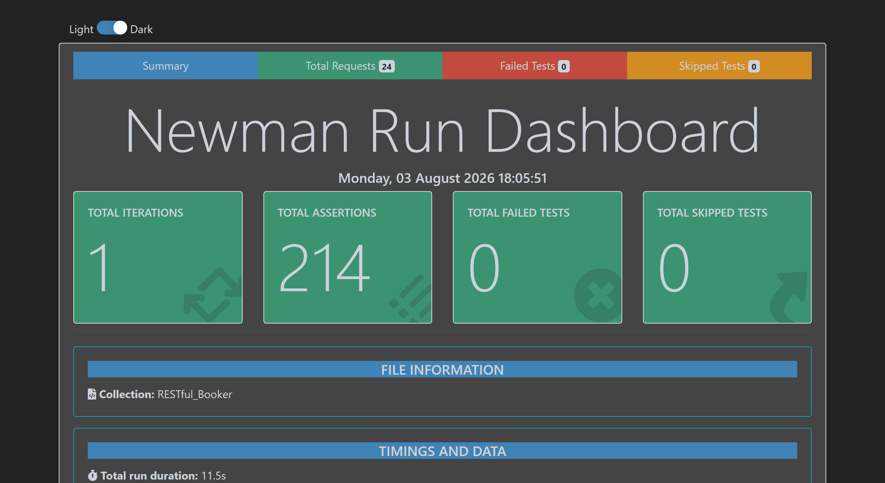

# RESTful Booker API Test Collection - Postman

[](https://github.com/teranastasi9-source/restful_booker_postman/actions/workflows/tests.yml)


Purpose: Postman collection for testing https://restful-booker.herokuapp.com/. Portfolio demonstration of API automation skills.

## Project Overview
|Aspect|Details|
|------|-------|
|**API Under Test**|RESTful Booker (Public demo REST API)|
|**Tool**|Postman + Newman CLI|
|**Auth**|Token (Cookie header)|
|**Test Types**|Integration Workflows + Mocked Security Test|
|**Variables**|Collection-scoped (self-contained)|

## Comparison: Postman vs Python
|Aspect|Postman + Newman|Pytest + requests + responses|
|------|--------------|---------------------|
|**Setup**|Import collection|Install dependencies|
|**Execution**|`newman run`|`pytest`|
|**Mocking**|Postman Mock Server|`responses` library|
|**Reports**|HTML via htmlextra|HTML via pytest-html|
|**Maintainability**|GUI-based|Code-based|
> Note: Python solution - see [restful_booker_automation repository](https://github.com/teranastasi9-source/restful_booker_automation)


## This project demonstrates:
  - REST API testing (CRUD operations, authentication, integration workflows)
  - Postman collection design and variable management
  - Security Testing (token validation)
  - Mocking Strategy (isolation for impractical scenario)
  - Newman CLI execution
  - HTML report generation
  - Documentation and reproducibility practices


## Project structure
```
restful_booker_postman/
  .github/workflows/tests.yml                        - CI: runs the collection via Newman on push/PR, nightly, manual
  Dockerfile                                           - optional containerized run (see "Run tests in Docker", Option C)
  .dockerignore                                          - keeps .git out of the Docker build context
  docs/report_screenshot.png                       - report screenshot embedded below, for a no-clone preview
  RESTful_Booker.Individual_collections_01_06.json   - separate requests required for integration tests
  RESTful_Booker.IntegrationWorkflows_07.json          - integration workflows built from the collection above
  run_integration_workflows_07.ps1                       - runs IntegrationWorkflows_07.json via Newman
  test_reports/
    report_IntegrationWorkflows_07.html                    - generated HTML report (Newman htmlextra)
  README.md
```


## Collection structure in Postman
| Folder| Purpose      |
|-------|--------------|
|`01_HealthCheck/`|API availability verification|
|`02_Authentication/`|Token generation|
|`03_Booking_Read/`|GET operations|
|`04_Booking_Create/`|POST operations|
|`05_Booking_Update/`|PUT/PATCH operations|
|`06_Booking_Delete/`|DELETE operations|
|`07_Integration_Workflows/`|Integration tests|


## Integration Workflows
### Workflow 1: Full CRUD Lifecycle
    [Given valid authentication credentials
    When I request an authentication token
    Then I receive a valid token

    When I create a new booking (no auth required)
    Then the booking is created with unique ID

    When I retrieve all booking IDs
    Then the new booking appears in the list

    When I retrieve the booking by ID
    Then all booking details match creation data

    When I fully update the booking (PUT with token)
    Then lastname and checkout are updated
    And all other fields are preserved

    When I retrieve the booking by ID
    Then the update is reflected correctly

    When I partially update the booking (PATCH with token)
    Then only firstname is updated
    And all other fields remain unchanged

    When I retrieve the booking by ID
    Then the partial update is reflected correctly
    
    When I delete the booking (DELETE with token)
    Then the deletion is successful
    
    When I attempt to retrieve the deleted booking
    Then I receive 404 Not Found

    When I retrieve all booking IDs again
    Then the deleted booking no longer appears]

### Workflow 2: Authentication Token Lifecycle
    [Given valid authentication credentials
    When I request an authentication token
    Then I receive a valid token

    When I create a new booking (no auth required)
    Then the booking is created with unique ID

    When I retrieve the booking by ID
    Then all booking details match creation data

    When I fully update the booking (PUT with token)
    Then lastname and checkout are updated
    And all other fields are preserved

    When I retrieve the booking by ID
    Then the update is reflected correctly

    When I attempt to update the booking with an expired token (mocked)
    Then I receive 403 Forbidden

    When I retrieve the booking by ID
    Then all booking details remain unchanged
    
    When I attempt to update the booking without the Cookie header
    Then I receive 403 Forbidden

    When I retrieve the booking by ID
    Then all booking details remain unchange

    When I partially update the booking (PATCH with token)
    Then only firstname is updated
    And all other fields remain unchanged

    When I retrieve the booking by ID
    Then the partial update is reflected correctly

    When I delete the booking (DELETE with token)
    Then the deletion is successful

    When I attempt to retrieve the deleted booking
    Then I receive 404 Not Found]

> Note: The `POST /booking` endpoint does not require authentication. 
> However, `PUT`, `PATCH`, and `DELETE` operations require a valid token.
> The expired token test uses a mocked server to simulate token expiration without waiting.


## Prerequisites
### Install Node.js 16+ (https://nodejs.org/)
    node --version
### Install Newman CLI
    npm install -g newman newman-reporter-htmlextra


## Test execution
Option A: PowerShell Script
  1. Open PowerShell in 'restful_booker_postman' folder
  2. Run: .\run_integration_workflows_07.ps1
  3. View results in browser (auto-opens)

Option B: Postman GUI
  1. Import collections into Postman
  2. Click Runner tab
  3. Select collection → Run

Option C: Docker (no Node.js/Newman install needed)
```bash
docker build -t restful-booker-postman .
docker run --rm -v "$(pwd)/test_reports:/etc/newman/test_reports" restful-booker-postman
```
The included `Dockerfile` is based on the official `postman/newman` image with the
`htmlextra` reporter pre-installed, so there's no local Node.js/npm setup needed at all. The
`-v` mount writes the HTML report back out to `test_reports/` on the host.

On Windows Git Bash specifically, prefix the command with `MSYS_NO_PATHCONV=1` (e.g.
`MSYS_NO_PATHCONV=1 docker run --rm -v "$(pwd)/test_reports:/etc/newman/test_reports" ...`) -
without it, Git Bash's automatic path translation silently mangles the `$(pwd)` mount so the
container runs fine but the report never actually reaches the host. PowerShell/cmd and
macOS/Linux shells aren't affected.

This is a
local/manual convenience, not part of CI - the GitHub Actions workflow already runs on a
consistent `ubuntu-latest` runner with Node set up directly, so containerizing it wouldn't add
anything there.


## Configuration
Variables are stored at collection scope:

| Variable | Description| Default Value |
|----------|------------|-----|
|base_url|Base URL for API Restful Booker|https://restful-booker.herokuapp.com|
|max_response_time|Maximum acceptable response time in milliseconds|1000|
|valid_username|Username for authentication|admin|
|valid_password|Password for authentication|password123|
|token|Token to use in future requests|(autopopulated after auth)|
|bookingid|ID for newly created booking|(autopopulated after creation)|
|firstname|Firstname for the guest who made the booking|(autogenerated)|
|lastname|Lastname for the guest who made the booking|(autogenerated)|
|totalprice|The total price for the booking|(autogenerated)|
|depositpaid|Whether the deposit has been paid or not|false|
|checkin|Date the guest is checking in|2026-02-12|
|checkout|Date the guest is checking out|2026-02-15|
|additionalneeds|Any other needs the guest has| Breakfast|
|updated_lastname|Lastname for the guest who made update booking|(autogenerated)|
|updated_checkout|Date the guest is checking out who made update booking|2026-02-16|
|partial_updated_firstname|Firstname for the guest who made partial update booking|(autogenerated)|
|partial_updated_lastname|Lastname for the guest who made partial update booking|(autogenerated)|
|restful_booker_mocked|Mock server|https://b46c2b66-2cdd-4ff5-abb5-388678ae176d.mock.pstmn.io|
> Note: These credentials are for the public demo API. 


## Expected output
After running, you should see:
  - All requests executed successfully
  - HTML report generated in test_reports/...
  - Report opens automatically in browser

Report includes:
  - Pass/fail status per request
  - Response times
  - Request/response details
  - Summary dashboard

**Live report:** redeployed to GitHub Pages after every push to `main` - see it at
[teranastasi9-source.github.io/restful_booker_postman](https://teranastasi9-source.github.io/restful_booker_postman/)
without cloning anything.

A recent run's report is also committed at `test_reports/report_IntegrationWorkflows_07.html` so
you can see the results without running anything - open it directly in a browser.



## CI

Runs on every push/PR, plus a weekly (Monday) scheduled run and manual `workflow_dispatch` (see
`.github/workflows/tests.yml`). The Newman step retries once automatically (see the known
mock-server flake below). If the **scheduled** run still fails after that retry, a GitHub
Issue is opened automatically (push/PR/manual runs are already being watched live, so they
don't) - a "don't let this go unnoticed" safety net.


## Troubleshooting
Issue: "newman: command not found"
  → Run: npm install -g newman newman-reporter-htmlextra

Issue: "callback timed out"
  → Check internet connection
  → Increase timeout in *.ps1 scripts

Issue: `update_booking_expired_token_mocked` fails with "expected N to be below 1000"
  → Postman's own mock server (`restful_booker_mocked`) occasionally responds slowly -
    verified 2026-08-03 that a failure here was a one-off latency spike, not a real
    regression (the very next run passed 214/214 with response times back under 900ms).
    CI retries this step once automatically; locally, just re-run the collection.


## Contact
- Anastasiia Zatorska
- Email: teranastasi9@gmail.com
- LinkedIn: http://www.linkedin.com/in/anastasiia9-zatorska


